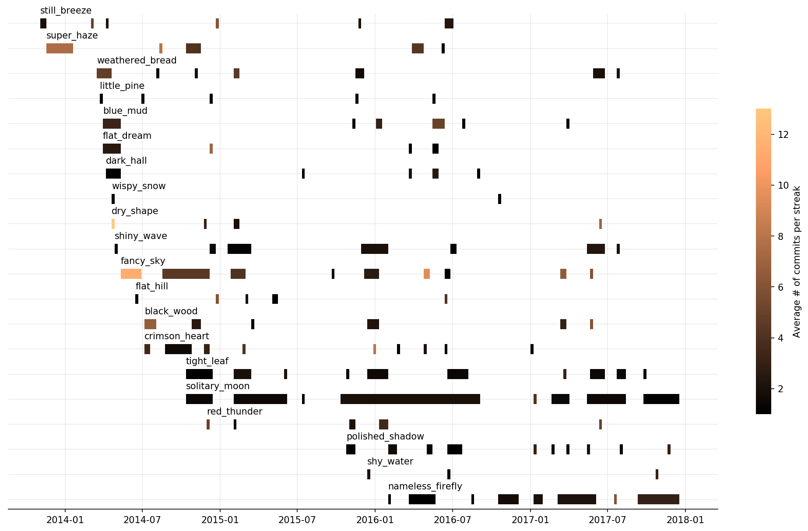

# Contributions gantt chart from GitHub

[](examples/velimir-top20.png)

Read more about script usage and examples in a blog [post](https://velimir.me.uk/historical-github-contributions-chart.html).

## Use

### Getting data

1. Clone repo
   ```
   $ git clone git@github.com:velimir0xff/contributions.git && cd contributions
   ```
2. Install dependencies:
   ```
   $ pip install -r ./requirements.txt
   ```
3. Set GITHUB_TOKEN environment variable. It's required to talk to GraphQL endpoint. You can get token on token [page](https://github.com/settings/tokens).
   ```
   $ export GITHUB_TOKEN=<token>
   ```
4. Run script:
   ```
   $ ./contributions.py > stats.json
   ```

For additional configuration options see script usage:
```
$ ./contributions.py -h
usage: contributions.py [-h] [-g URL] [-u USERNAME] [-o OWNERS] [-v] [-n] [-m MAX_CONCURRENCY]
                        [-c MAX_CONTRIBUTORS] [--out OUT]

List projects to which user have contributed to. Script requires valid GitHub token set via GITHUB_TOKEN environment variables.

optional arguments:
  -h, --help            show this help message and exit
  -g URL, --url URL     GitHub base url (default: https://api.github.com)
  -u USERNAME, --username USERNAME
                        Contributor username
  -o OWNERS, --owner OWNERS
                        Owners to check
  -v, --verbose         Verbose mode (default: False)
  -n, --no-progress     Verbose mode (default: False)
  -m MAX_CONCURRENCY, --max-concurrency MAX_CONCURRENCY
                        Maximum # of concurrent requests to GitHub (default: 20)
  -c MAX_CONTRIBUTORS, --max-contributors MAX_CONTRIBUTORS
                        Maximum # of concurrent requests to GitHub contributors endpoint (default:
                        20)
  --out OUT             output file with contributions (default=stdout)
```

### Data visualization

In order to generate chart use `contributions.ipynb` jupyter notebook in the repo root directory.
Configure `filename` variable to point to stats data generated by script (example: `filename = 'examples/uwiger.json'`) and run all cells.

To save pictures just add the following line at the end of the notebook:
```python
fig.savefig('my-stats.png', dpi=300, bbox_inches='tight')
```

or if you want a transparent version:
```python
fig.savefig('my-stats.png', dpi=300, bbox_inches='tight', transparent=True)
```

## Contribute

Please feel free to submit pull requests to this repository or open an issue.
